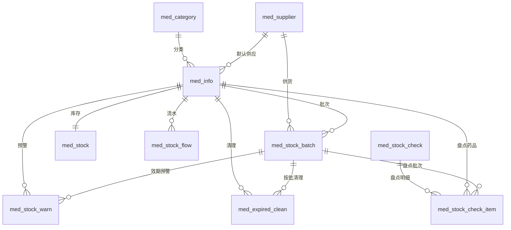

# AI 医院药品进销存信息管理系统 —— 系统设计文档

## 一、模块设计

### 1. 药品分类管理（med_category）

树形结构管理药品分类，支持处方药、非处方药、中成药、其他四种药品类型。上级分类停用后不允许新增子分类；分类下存在子分类或已关联药品时不允许删除；分类调整上级时自动同步子分类的祖级列表。

### 2. 药品信息管理（med_info）

维护药品编码、通用名、商品名、分类、默认供应商、规格、剂型、单位、生产厂家、批准文号、存储条件、参考进价、零售价，以及库存下限、库存上限、临期预警天数。库存上下限与临期预警天数是库存预警和效期管理的规则来源，因此保存时校验下限不能大于上限，并在药品列表中直接展示当前库存数量，低于下限或高于上限时以颜色提示。

### 3. 供应商信息管理（med_supplier）

维护供应商编码、名称、联系人、电话、地址、经营许可证号与有效期、资质状态、信用等级、合作状态。供应商编码唯一；资质临近到期或已过期的供应商在列表中用标签提示，便于及时跟进换证。

### 4. 库存盘点管理（med_stock_check、med_stock_check_item）

主子表结构。主表记录盘点单号、名称、类型、状态、盘点日期、盘点人、审核信息；明细表按药品与批次记录账面数量、实盘数量、盈亏数量、盈亏类型与盈亏原因。新增盘点单时可按当前批次库存自动带出账面明细，录入实盘数量后自动计算盈亏，审核时按盈亏数量调整库存。

### 5. 库存预警管理（med_stock_warn）

预警记录表，分为库存不足、库存积压、近效期、已过期四类，级别分为提示、警告、严重，支持处理与忽略。预警由扫描功能生成，扫描时先按药品的临期预警天数刷新批次状态，再汇总库存与效期数据，同一药品、批次、类型在未处理状态下不重复生成。

### 6. 药品有效期管理（med_stock_batch）

按批次管理药品的生产批号、生产日期、有效期、批次数量、剩余数量与批次状态，支持按批号、药品、批态、是否过期、有效期区间筛选，提供临期与过期药品统计接口。批次状态刷新规则为：剩余数量为 0 记已清理，有效期已过记过期，进入临期天数范围记临期，其余为正常。

批次数量属于库存数据，只能由入库、出库、盘点、过期清理等业务变更，页面不提供手工新增、修改、删除批次数量的功能，只允许修正生产日期、有效期、供应商、备注等效期信息，避免绕过库存变更入口改数量导致库存总量与批次之和不一致。对于已经出现不一致的历史数据，提供“库存总量重算”接口，按批次剩余数量之和重算库存总量并写入流水。

### 7. 过期药品清理管理（med_expired_clean）

记录过期药品的清理单号、批次、清理数量、清理方式（退货、销毁、报损）、清理原因与审核状态。新增时校验批次存在且清理数量不超过批次剩余数量，非报损方式要求批次已过期；确认清理后在同一事务内扣减库存与批次数量并登记库存流水。

### 8. 库存变更服务（med_stock、med_stock_flow）

作为库存变更的统一入口，提供库存数量查询与库存变更方法。库存变更方法在执行更新前对库存行加锁，校验扣减后数量不为负，更新库存数量后写入库存流水，记录变动前后数量、业务类型、业务单号与操作人。入库、出库、退库、盘点调整、过期清理共用该入口。

库存总量与批次数量是同一批数据的汇总与明细，业务上要求两者始终相等。为保证这一点，批次数量不提供任何直接修改入口，只允许通过本服务变更；同时提供按批次重算库存总量的修正方法，用于对账后拉平历史数据。

## 二、数据库设计

### 1. 表清单

| 表名 | 说明 | 写入方 |
| --- | --- | --- |
| med_category | 药品分类表（树形） | 基础资料模块 |
| med_supplier | 供应商信息表 | 基础资料模块 |
| med_info | 药品信息表 | 基础资料模块 |
| med_stock | 药品库存表 | 库存变更服务统一写入 |
| med_stock_batch | 药品库存批次表 | 入库业务写入，效期管理维护状态 |
| med_stock_flow | 库存流水表 | 库存变更服务统一写入 |
| med_stock_check | 库存盘点主表 | 库存盘点模块 |
| med_stock_check_item | 库存盘点明细表 | 库存盘点模块 |
| med_stock_warn | 库存预警记录表 | 库存预警模块 |
| med_expired_clean | 过期药品清理记录表 | 过期药品清理模块 |

### 2. 实体关系

### 3. 关键字段说明

med_info 中的 stock_min（库存下限）、stock_max（库存上限）决定库存不足与库存积压的判定阈值；warn_days（临期预警天数）决定批次进入临期状态的天数范围。med_stock 中 total_qty 为库存总数量，与批次剩余数量之和保持业务一致。med_stock_flow 中 flow_type 取值 1 入库、2 出库、3 退库、4 盘点调整、5 过期清理，change_qty 正数为增加、负数为减少，同时记录变动前后数量便于追溯。

## 三、接口约定

所有接口沿用若依规范，列表接口使用 GET + 分页参数 pageNum、pageSize，返回 `{ code, msg, rows, total }`；其他接口返回 `{ code, msg, data }`。

| 接口 | 方法 | 说明 | 权限标识 |
| --- | --- | --- | --- |
| /system/category/list | GET | 查询药品分类树形列表 | system:category:list |
| /system/category/treeselect | GET | 查询药品分类下拉树 | 登录即可 |
| /system/category | POST/PUT | 新增、修改分类 | system:category:add / edit |
| /system/category/{ids} | DELETE | 删除分类 | system:category:remove |
| /system/info/list | GET | 查询药品信息（含分类、供应商、当前库存） | system:info:list |
| /system/info/optionselect | GET | 查询药品下拉选项 | 登录即可 |
| /system/supplier/list | GET | 查询供应商信息 | system:supplier:list |
| /system/supplier/optionselect | GET | 查询供应商下拉选项 | 登录即可 |
| /system/check/list | GET | 查询盘点单列表 | system:check:list |
| /system/check/bookItems | GET | 按批次库存生成账面明细 | system:check:list |
| /system/check/audit/{checkId} | PUT | 盘点审核并调整库存 | system:check:audit |
| /system/warn/scan | POST | 扫描生成库存预警 | system:warn:scan |
| /system/warn/list | GET | 查询预警列表 | system:warn:list |
| /system/warn/summary | GET | 查询预警统计 | system:warn:list |
| /system/warn/handle | PUT | 处理或忽略预警（支持批量） | system:warn:handle |
| /system/batch/list | GET | 查询批次与有效期列表 | system:batch:list |
| /system/batch/expirySummary | GET | 临期与过期统计 | system:batch:list |
| /system/batch/refresh | PUT | 刷新批次效期状态 | system:batch:edit |
| /system/batch/expiry | PUT | 修正批次效期信息（不含数量） | system:batch:edit |
| /system/batch/recalcStock | POST | 按批次剩余数量重算库存总量 | system:batch:recalc |
| /system/expiredclean/list | GET | 查询过期药品清理列表 | system:expiredclean:list |
| /system/expiredclean/confirm/{cleanId} | PUT | 确认清理并扣减库存 | system:expiredclean:confirm |
| /system/expiredclean/reject/{cleanId} | PUT | 驳回清理申请 | system:expiredclean:confirm |

## 四、与其他模块的对接

1. 库存出入库模块：库存变更统一调用 `adjustStock` 方法，业务类型、业务单号、业务主键由调用方传入，库存流水由该方法统一生成，避免多处直接修改库存导致数据不一致。
2. AI 智能模块：库存不足、近效期、已过期等实时查询可直接调用库存预警统计接口、有效期统计接口，以及库存变更服务中的库存数量查询方法，作为智能补货提醒与过期清理提醒的数据来源。
3. 数据看板模块：库存预警统计接口返回未处理预警总数、库存不足数、库存积压数、近效期数、已过期数与严重级别数；有效期统计接口返回临期批次数、过期批次数、临期数量、过期数量与正常在库数量，可直接用于图表展示。

## 五、前端页面清单

| 页面路径 | 页面名称 | 主要功能 |
| --- | --- | --- |
| system/category/index | 药品分类 | 树形分类维护、新增子分类、展开折叠 |
| system/info/index | 药品信息 | 药品资料维护、库存上下限设置、库存数量对比提示 |
| system/supplier/index | 供应商信息 | 供应商资料与资质维护 |
| system/check/index | 库存盘点 | 盘点单维护、明细录入、盈亏自动计算、审核调整库存 |
| system/warn/index | 库存预警 | 预警统计卡片、扫描生成预警、处理与忽略 |
| system/batch/index | 药品有效期 | 批次效期查询、临期与过期筛选、效期状态刷新、效期信息修正、库存总量重算 |
| system/expiredclean/index | 过期药品清理 | 清理申请、确认扣减库存、驳回 |
